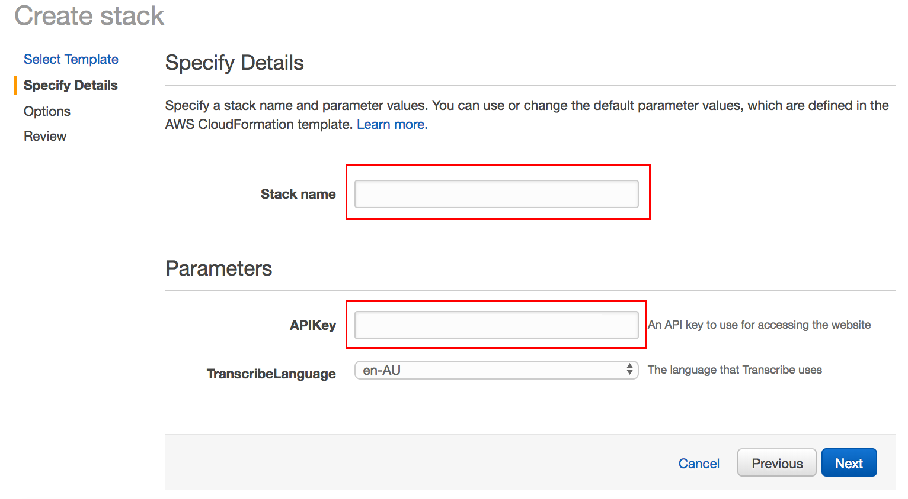
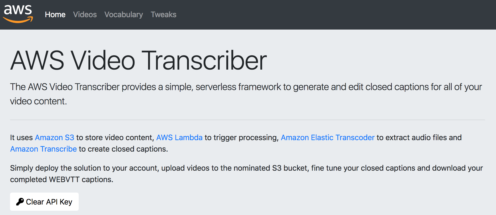
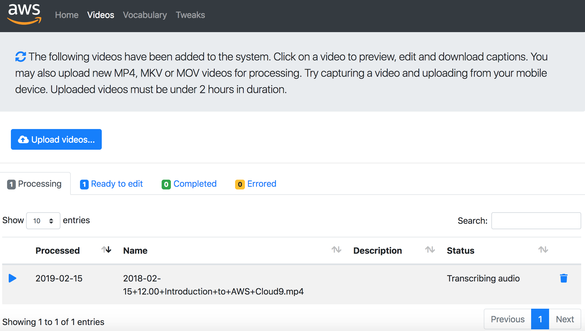

## AWS Video Transcriber

The code provides a serverless single page web application and set of supporting API Gateway end points and Lambda functions which allow users to upload videos into S3 and compute and edit closed captions.

## On this Page
- [License](#license)
- [Architecture](#architecture)
- [Deploying the Solution](#deploying-the-solution)
- [Removing the Solution](#removing-the-solution)
- [Solution Pricing](#solution-pricing)
- [Launching the Website](#launching-the-website)
- [Entering your API Key](#entering-your-api-key)
- [Creating a Vocabulary](#creating-a-vocabulary)
- [Creating Tweaks](#creating-tweaks)
- [Listing Videos](#listing-videos)
- [Uploading Videos](#uploading-videos) 
- [Editing Captions](#editing-captions)
- [Downloading Captions](#downloading-captions)

## License

This library is licensed under the Apache 2.0 License. 

## Architecture

## Deploying the Solution

Prebuilt CloudFormation templates and assets have been deployed to AWS regions with both Amazon Transcribe and Amazon Elastic Transcoder. Click a button below to deploy to your region of choice.

When launching the template, you will need to enter a stack name and an API key. The API Key is used to provide to users access to the system. You must provide astrong, random, alpha-numeric API key between 20 and 70 characters long.

### One click deployment

| Region | Region Id | Deploy now |
| ---- | ----  | ---- |
| US East (N. Virginia) | us-east-1 |  |
| US West (N. California) | us-west-1 |  |
| US West (Oregon) | us-west-2 |  |
| EU (Ireland) | eu-west-1 |  |
| Asia Pacific (Singapore) | ap-southeast-1 |  |
| Asia Pacific (Sydney) | ap-southeast-2 |  |
| Asia Pacific (Mumbai) | ap-south-1 |  |

### Accessing parameters after deployment

After launching the parameters will also provide the link to access the deployed website and the API key you entered above.

### Deploying to multiple regions

IAM roles and policies are global and are prefixed with the stack name, if you get conflicts, simply use a different stack name in each deployed region.

## Removing the Solution

To remove the solution delete the CloudFormation stack. Note that deletion will fail if you have not emptied to video, audio and transcribe buckets.

*NOTE: after remove the stack occasionally the CloudWatch log for the Lambda custom resource is left behind and must be manually removed before deploying again.*

## Solution Pricing

You are responsible for the cost of the AWS services used while running the video transcription solution. As of the date of publication, the cost for running this solution in the US East (N.
Virginia) Region is shown in the table below. 

The cost depends on the number of length of uploaded videos, and does not include data transfer fees, which will vary
depending on the number of users and frequency of viewing.

You will also be charged for stored video and audio files in S3.
		
Video transcoding costs (for non-MP4 videos):

	$0.03 per minute

Audio Transcoding costs:

	$0.0045 per minute

Transcribe costs:

	$0.024 per minute
	
Amazon S3 Storage costs:

	$0.023 per GB per month
	
[Amazon Transcribe Pricing](https://aws.amazon.com/transcribe/pricing/)

[Amazon Elastic Transcoder Pricing](https://aws.amazon.com/elastictranscoder/pricing/)

[Amazon S3 Pricing](https://aws.amazon.com/s3/pricing/)

Pricing is quoted per minute but Amazon Transcribe charges per second. Prices are subject to
change. For full details, see the pricing webpage for each AWS service for the region you deploy the solution to.

## Launching the Website

Once you have deployed your stack the link to your new site is displayed in the *CloudFormation Outputs tab* along with your API Key.

## Entering your API key

On the home page there is a button for entering your API key, locate your API key using the parameters tab of the CloudFormation service after deployment.

	
## Creating a Vocabulary

After deployment log into your site, click on the Vocabulary tab and create a custom vocabulary with at least one term. You might consider using:

	A.W.S.
	
You can enter up to 50kb of custom vocacaulary terms, if you get a failure to save please read the [Amazon Transcribe formatting guide for custom vocabularies](https://github.com/awsdocs/amazon-transcribe-developer-guide/blob/master/doc_source/custom-vocabulary-files.md).
	

	
## Creating Tweaks

After deployment log into your site, click on the Tweaks tab and create a custom tweak configuration with at least one term. You might consider using:

	A.W.S.=AWS
	
Tweaks are used to transform common transcription issues you might find and also to correct Amazon Transcribe custom vocabulary verbatim transcriptions.

## Listing Videos

The Videos page shows the current videos in the system and organsises them in tabs based on their processing status. You can search for videos here, trigger reprocessing, delete videos and download captions for completed videos.

## Uploading Videos

You cna upload videos from any browser and launching the site on mobile allows users to capture and upload videos directly from a mobile phone.

Click on the *Upload Videos...* button to start the process.

## Editing Captions

Once your video has been transcribed you can tweak the captions to get things perfect. When first viewing the video, the system starts in a mode that pauses between each caption block, toggle this mode to view the video continously.

You can also edit the video name and description here to assist in searching for the video and organising your video collection.

Once you have perfected the captions for a video, click the *Done* button to move the video to the completed tab.

The *Auto save* function flushes edits regularly to DynamoDB.

## Downloading Captions

You can download completed cpations from the [Caption editing page](#editing-captions) or from the table on the completed videos tab.

