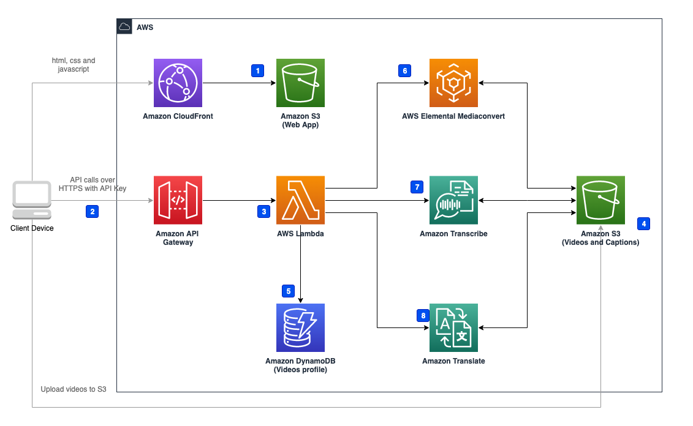

## AWS Video Transcriber

This solution is built on AWS Lambda serverless architecture, the solution integrates services such as Amazon Transcribe to help customers complete video caption related operations on a web interface, for example, automatically generating video captions, proofreading and editing video captions, translating captions, and burning captions into videos.

The solution includes the following functions:
* Generating captions: supports uploading MP4, MOV and MKV videos
* Choose Amazon Transcribe Custom vocabulary: before user upload videos, user can choose existing custom vocabulary, Amazon Transcribe will use this vocabulary to transcrip video to captions.
* Editing captions: supports proofreading, editing, paragraph splitting and merging, mapping, and replacement of captions.
* Translating captions: supports translation from the source language to the target language. Currently, this is only supported by the deployment in AWS Classic Regions.
* Downloading captions: supports SRT or WEBVTT.
* Burning captions: supports burning generated captions into videos, and then downloading the videos with captions.
videos.

## Architecture


This solution deploys the Amazon CloudFormation template in your AWS Cloud account and completes the following settings.

1. [Amazon S3][s3] (Web App) stores front-end static files
2. Client side sends the request through [Amazon API Gateway][api-gateway]
3. [AWS Lambda][lambda] Function receives the request from Amazon API Gateway, and process the business logic
4. Client side gets the pre-signed URL from AWS Lambda, then uploads the video to be processed
5. AWS Lambda Function gets/updates videos' profile from [Amazon DynamoDB][dynamodb]
6. AWS Lambda Function invokes [AWS Elemental MediaConvert][mediaconvert] to process video, which includes extracting audio from video and burning captions into video and stores the result into Amazon S3 (Videos)
7. AWS Lambda Function invokes [Amazon Transcribe][transcribe] captions from audio and store the result into Amazon S3 (Captions)
8. AWS Lambda Function invokes [Amazon Translate][translate] to translate captions to another language and stores the result into Amazon S3 (Captions)

## Deploying the Solution

Prebuilt CloudFormation templates and assets have been deployed to AWS regions with both Amazon Transcribe and Amazon Elemental MediaConvert. When launching the template, you will need to enter a stack name, an API key and choose a language as default language that Transcribe will use to process your video's audio data. You can still select language before upload the video to process

The API Key is used to provide to users access to the system. You must provide a strong, random, alpha-numeric API key between 20 and 70 characters long. Otherwise the stack will fail to launch and you will see "Invalid Key Error"


### One click deployment

| AWS Region Name | AWS Region Id | Deploy Solution |
| ---- | ----  | ---- |
| US East (N. Virginia) | us-east-1 | [](https://console.aws.amazon.com/cloudformation/home?region=us-east-1#/stacks/create/template?stackName=VideoTranscriber&templateURL=https://aws-gcr-solutions.s3.amazonaws.com/Video-Transcriber/latest/video-transcriber-deploy.template) |
| China (Beijing) | cn-north-1 | [](https://cn-north-1.console.amazonaws.cn/cloudformation/home?region=cn-north-1#/stacks/create/template?stackName=VideoTranscriber&templateURL=https://aws-gcr-solutions.s3.cn-north-1.amazonaws.com.cn/Video-Transcriber/latest/video-transcriber-deplo-cn.template) |
| China (Ningxia) | cn-northwest-1 | [](https://cn-northwest-1.console.amazonaws.cn/cloudformation/home?region=cn-northwest-1#/stacks/create/template?stackName=VideoTranscriber&templateURL=https://aws-gcr-solutions.s3.cn-north-1.amazonaws.com.cn/Video-Transcriber/latest/video-transcriber-deplo-cn.template) |


## Solution Pricing

You are responsible for the cost of using Amazon Web Service's services used while running this solution. As of December 2022, the cost of the solution varies depending on:

- The number of requests to Amazon API Gateway
- The number of invoking AWS Lambda 
- The number of read/write Amazon DynamoDB
- The number of videos that AWS Elemental MediaConvert processed. The solution uses AWS Elemental MediaConvert to extract audios from videos or burn captions into videos
- The number of audios that Amazon Transcribe processed. The solution uses Amazon Transcribe to extract text from audio and generate captions
- The number of captions characters that Amazon Translate processed. The solution uses Amazon Translate to translate the captions to another language. 

## Example: In US East (N. Virginia) Region (us-east-1), process 1 hour video, edit video captions for 500 times, tranlsate 10000 characters captions

The cost of using this solution to process this video is shown below:

| Service | Dimensions | Cost |
|---|---|---|
| AWS Elemental MediaConvert | Extract 1 hour audio | $0.18     |
| AWS Elemental MediaConvert | Burn captions into 1 hour video | $0.45     |
| Amazon Transcribe | Extract text from 1 hour audio | $1.44 |
| Amazon Translate | tranlsate 10000 characters | $0.15 |
| Amazon API Gateway | 500 requests | $0.0017 |
| AWS Lambda | 500 requests (avg 300ms, 128MB Memory) | $0.0001 |
| Amazon DynamoDB | 1000 read/write | $0.00075 |
|  |  | Total: $2.22 |

## Access the web interface

After the stack is successfully created, you can view the authentication information (**APIKey**) required to access the web interface and the created CloudFront URL (**ConsoleUrl**) on the **Outputs** tab of AWS CloudFormation stack.

1. Enter the CloudFront URL in the address bar of the browser.

2. Select **Enter API Key**, and enter the authentication information in the pop-up input box.

## Upload videos and perform operations related to video captions

In the web interface, select **Videos** at the top of the page. The page displays four tabs, corresponding to the different status of videos:

- Videos being processed
- Videos ready for editing
- Videos marked as editing completed
- Videos with errors during processing


### Upload video

You can upload videos without captions for processing.

1. On the **Videos** page, select **Upload videos...**.

2. Select the video, then select **Open**.

3. Select the video language, select custom vocabulary from **select a vocabulary** if you need (refer to [Custom Vocabulary][transcribe-custom-vocabulary] to learn more about custom vocabulary), and then choose **Start**. The system will start uploading the video and automatically process and generate captions.

Firstly, the video is displayed on the **Processing** tab, and after the captions are generated, the video will be displayed on the **Ready to edit** tab.

### Proofread and edit captions 

You can proofread and edit the video captions.

1. On the **Videos** page, select the **Ready to edit** tab.

2. Select the language link from the **Video Language** column to enter the captions editing page. The functions include:
- Play the video content paragraph by paragraph to proofread the captions.
- Modify the captions.
- Merge or split captions parapraphs.

### Translate captions

You can translate the video captions, and then proofread and edit translated captions.
**Note: Currently, this feature is only supported by the deployment in AWS Standard Regions.**

1. On the captions editing page, select **Translate to**.

2. After selecting the target language in the drop-down list, the system will translate the captions into the target language. After the translation is completed, you can also proofread and edit the translated captions.


### Burn captions into the video
You can burn the generated captions into the video to create the video with captions.

1. On the **Videos** page, select the **Ready to edit** tab.

2. Select the language link from the **Video Language** column to enter the captions editing page.

3. Select **Burn in**.


### Download captions or video with captions

After the captions or videos with captions are generated, you can download them directly:

- If the video is in the editing status, select the video and the corresponding language to enter the video editing page to download.


- If the video is in the completed status, you can directly download the captions or videos in the corresponding language of the video on the **Completed** tab of the **Videos** page.


### Custom code and build locally.
If you wish to customize the solution, you can follow the steps below:

1. Clone the repo to your local machine

2. Go to the **deployment** directory
```
cd deployment
```

3. Run the following commands to build the solution:
```
chmod +x ./build-s3-dist.sh
./build-s3-dist.sh <DIST_OUTPUT_BUCKET> <SOLUTION_NAME> <VERSION>
```
**DIST_OUTPUT_BUCKET**: the S3 bucket where the cloudformation template is located, you can use existing one or create a new bucket, e.g. your-bucket
**SOLUTION_NAME**: the desired name of the solution, e.g. video-transcriber
**VERSION**: e.g. v1.0.0

4. Run the following commands to upload the built CloudFormation template to the corresponding S3 Bucket:
```
aws s3 cp deployment/global-s3-assets/ s3://<DIST_OUTPUT_BUCKET>/<SOLUTION_NAME>/<VERSION>/ --recursive
```

5. Run the following commands to upload the built resources to the corresponding S3 Bucket, if you want to deploy the solution in us-east-1 region, the bucket should be <DIST_OUTPUT_BUCKET>-us-east-1.

```
aws s3 cp deployment/regional-s3-assets/ s3://<DIST_OUTPUT_BUCKET>-us-east-1/<SOLUTION_NAME>/<VERSION>/ --recursive
```

6. Use the cloudformation template to deploy the solution. The template link should be: s3://<DIST_OUTPUT_BUCKET>/<SOLUTION_NAME>/<VERSION>/video-transcriber-deploy.template


## License

This library is licensed under the Apache 2.0 License.

[s3]: https://aws.amazon.com/s3/
[api-gateway]: https://aws.amazon.com/api-gateway/
[lambda]: https://aws.amazon.com/lambda/
[dynamodb]: https://aws.amazon.com/dynamodb/
[mediaconvert]: https://aws.amazon.com/mediaconvert/
[transcribe]: https://aws.amazon.com/transcribe/
[translate]: https://aws.amazon.com/translate/
[transcribe-custom-vocabulary]:https://docs.aws.amazon.com/transcribe/latest/dg/custom-vocabulary.html