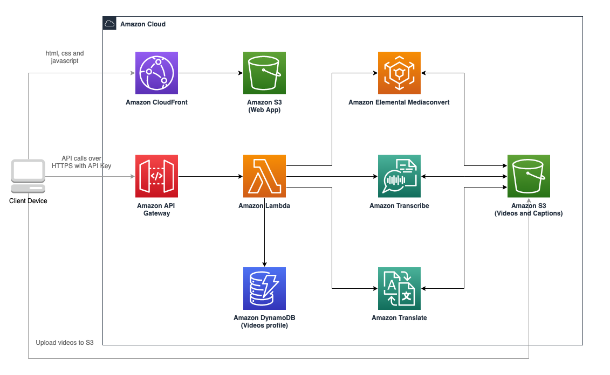

## AWS Video Transcriber

This solution provides a serverless, single page web application and set of supporting Amazon API Gateway end points and backing AWS Lambda functions which allow users to upload videos into Amazon S3 and compute and edit closed captions.

## Architecture

## Deploying the Solution

Prebuilt CloudFormation templates and assets have been deployed to AWS regions with both Amazon Transcribe and Amazon Elemental MediaConvert. When launching the template, you will need to enter a stack name, an API key and choose a locale that Transcribe will use to process your video's audio data.

The API Key is used to provide to users access to the system. You must provide a strong, random, alpha-numeric API key between 20 and 70 characters long. Otherwise the stack will fail to launch and you will see "Invalid Key Error"

### One click deployment

| AWS Region Name | AWS Region Id | Deploy Solution |
| ---- | ----  | ---- |
| US East (N. Virginia) | us-east-1 |  |
| US West (N. California) | us-west-1 |  |
| US West (Oregon) | us-west-2 |  |
| EU (Ireland) | eu-west-1 |  |
| Asia Pacific (Singapore) | ap-southeast-1 |  |
| Asia Pacific (Sydney) | ap-southeast-2 |  |
| Asia Pacific (Mumbai) | ap-south-1 |  |
| China (Beijing) | cn-north-1 |  |
| China (Ningxia) | cn-northwest-1 |  |

## Solution Pricing

You are responsible for the cost of the AWS services used while running the video transcription solution. As of the date of publication, the costs for running this solution in the US East (N. Virginia) Region are shown in the table below. 

The cost depends on the number of and length of uploaded videos, and does not include data transfer fees, which will vary depending on the number of users and frequency of viewing.

You will also be charged for stored video and audio files in S3.
		
Video transcoding costs (for non-MP4 videos):

	$0.0057 per minute

Transcribe costs:

	$0.024 per minute
	
Amazon S3 Storage costs:

	$0.023 per GB per month

Pricing is quoted per minute but Amazon Transcribe actually charges per second. Prices are subject to change. For full details, see the pricing webpage for each AWS service for the region you deploy the solution to.

[Amazon Transcribe Pricing](https://aws.amazon.com/transcribe/pricing/)

[Amazon Elastic Transcoder Pricing](https://aws.amazon.com/mediaconvert/pricing/)

[Amazon S3 Pricing](https://aws.amazon.com/s3/pricing/)

## Launching the Website

Once you have deployed your stack, the cloudfront link to your website is displayed in the CloudFormation Outputs tab along with your API Key. Click the Website link to access the site.

## Entering your API key

On the home page there an *Enter API Key* button used for entering your API key, locate your API key using the *Outputs* tab of the CloudFormation service after deployment and enter it.

	

## Listing Videos

The Videos page shows the current videos in the system and organizes them into tabs based on their processing status. You can search for videos here, start the caption editing process, trigger reprocessing, delete videos and download captions for completed videos.

## Uploading Videos

You can upload videos from browser, Click on the Upload Videos... button to start the video upload process.

New AWS accounts have a service limit of 10 concurrent transcription jobs, this limit can be raised with an AWS service ticket. Videos launched above this threshold will fail and can be relaunched from the Errored tab.

## Editing Captions

Once your video has been transcribed you can tweak the captions to get things perfect. When first viewing the video, the system starts in a mode that pauses between each caption block, toggle this mode to view the video continuously.

Once you have perfected the captions for a video, click the Done button to move the video to the completed tab, and can also burn captions into the video.

## License

This library is licensed under the Apache 2.0 License.

## Downloading Captions

You can download completed captions or burned videos from the table on the completed videos tab.

## Troubleshooting Deployment

### Deploying to multiple regions

IAM roles and policies are global and are prefixed with the stack name, if you get IAM role or policy conflicts, simply use a different stack name in each deployed region.

### Deploying multiple solution instances to a single AWS region

This is not currently supported but will be considered if there is customer demand. It will require all resources to be prefixed with the CloudFormation AWS::StackName pseudo parameter.

### Invalid API Key

If you see the following error while launching your CloudFormation stack:

Please verify the API Key you provided is between 20 and 70 characters long and only contains Alpha-Numeric characters, it uses the following regex:

	[a-zA-Z0-9]{20,70}