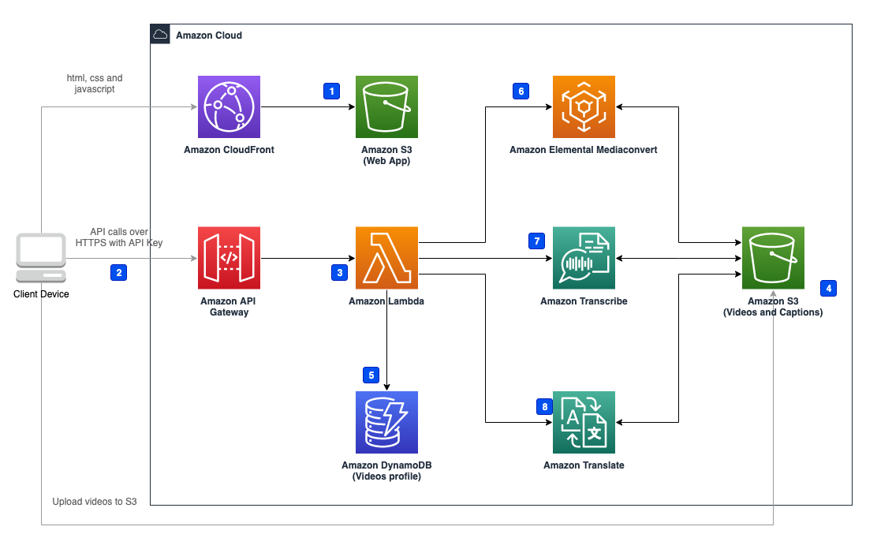

Deploying this solution with the default parameters builds the following environment in the Amazon Web Services Cloud.

Figure: Solution Architecture

This solution deploys the Amazon CloudFormation template in your Amazon Cloud account and completes the following settings.

1. [Amazon S3][s3] (Web App) stores front-end static files.
2. Client side sends the request through [Amazon API Gateway][api-gateway].
3. [Amazon Lambda][lambda] Function receives the request from Amazon API Gateway, and process the business logic.
4. Client side gets the pre-signed URL from Amazon Lambda, then uploads the video to be processed.
5. Amazon Lambda Function gets/updates videos' profile from [Amazon DynamoDB][dynamodb].
6. Amazon Lambda Function invokes [Amazon Elemental MediaConvert][mediaconvert] to process video, which includes extracting audio from video and burning captions into video and stores the result into Amazon S3 (Videos).
7. Amazon Lambda Function invokes [Amazon Transcribe][transcribe] captions from audio and store the result into Amazon S3 (Captions).
8. Amazon Lambda Function invokes [Amazon Translate][translate] to translate captions to another language and stores the result into Amazon S3 (Captions).

The solution deploys a Web application into Amazon S3 bucket, and the resources in Amazon S3 can only be accessed through Amazon CloudFront.

Amazon API Gateway authenticates through API Key, and clients must enter the correct API Key to access Amazon API Gateway.

[s3]: https://aws.amazon.com/s3/
[api-gateway]: https://aws.amazon.com/api-gateway/
[lambda]: https://aws.amazon.com/lambda/
[dynamodb]: https://aws.amazon.com/dynamodb/
[mediaconvert]: https://aws.amazon.com/mediaconvert/
[transcribe]: https://aws.amazon.com/transcribe/
[translate]: https://aws.amazon.com/translate/