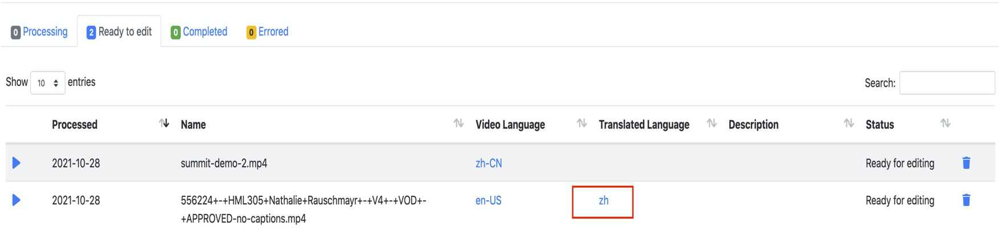
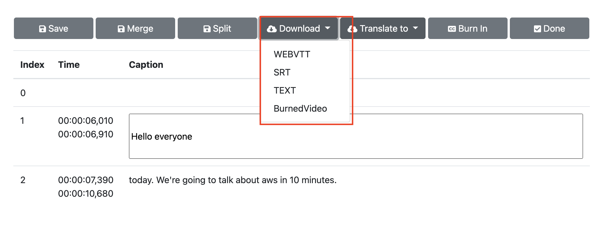

Before you launch the solution, review the architecture, supported regions, and other considerations discussed in this guide. Follow the step-by-step instructions in this section to configure and deploy the solution into your account.

**Time to deploy**: Approximately 10 minutes

## Deployment overview

Use the following steps to deploy this solution on Amazon Web Services.

- Step 1: Launch the Amazon CloudFormation template into your Amazon account
    - Launch CloudFormation tempalte in Amazon Web Services China Regions 
    - Launch CloudFormation template in Amazon Web Services Standard Regions
- Step 2: Access the web interface 
- Step 3: Upload videos and perform operations related to video captions

## Step 1: Launch the Amazon CloudFormation template

This automatic Amazon CloudFormation template deploys the solution in Amazon Web Services.

### Launch CloudFormation tempalte in Amazon Web Services China Regions

**Prerequisites**

1. Make sure a domain registered by ICP is available. Because the CloudFront address in Amazon China Regions cannot be accessed directly, this domain name will be used as a CNAME to point to the CloudFront address created after the solution is deployed, and you can access the solution through this domain.
2. Make sure a domain hosting zone is available. If you haven’t created a hosted zone, please refer to [Use hosted zone][hostedzone].

**Launch Amazon CloudFormation template**

1. Log in to the Amazon Web Services management console, select [Amazon Web Services China (Beijing) Region operated by Sinnet][template-china1] or [Amazon Web Services China (Ningxia) Region operated by NWCD][template-china2] to launch Amazon CloudFormation template.

2. The template will be launched in the default region after you log in to the console. Please select from the region drop-down list in the console navigation bar to switch to other regions if you need to change the region.

3. On the **Create stack** page, confirm that the correct template URL is displayed in the Amazon S3 URL text box, and then choose **Next**.

4. On the **Specify stack details** page, assign a unique name in your account that meets the naming requirements for your solution stack.

5. In the **Parameters** section, view the parameters of the solution template and modify as needed, and then choose **Next**.

    |  Parameter Name   |  Default Value |  Description |
    |  ----------  | ---------| -----------  |
    | **APIKey**  | N/A  | Enter the authentication information required to log in to the web interface after the deployment.|
    | **TranscribeLanguage**    | zh-CN    | Select the default caption processing language. Currently, it supports en-AU, en-US, en-GB, es-US, en-IN, de-DE, hi-IN, pt-BR, pt-PT, fr-CA, fr-FR, it-IT, ta-IN, te-IN, zh-CN, ja-JP, ko-KR, ar-AE and ar-SA. Refer to [Amazon Transcribe][transcribe-support-language] to learn more about supported language and language code. |

6. On the **Configure stack options** page, choose **Next**.

7. On the **Review** page, review and confirm the settings. Check the box acknowledging that the tempalte creates Amazon Identity and Access Management (IAM) resources.

8. Choose **Create stack** to deploy the stack.

You can check the status of the stack in the **Status** column of the Amazon CloudFormation console. You should receive a **CREATE_COMPLETE** status in approximately 10 minutes.

**Create records on Route53 to resolve domain names**

1. Log in to Route53 Console, and choose **Create record**.

2. Enter the required subdomain in **Record name** text box. The suffix is the top-level domain registered by ICP, for example, video-transctiber.ch.test.com.

3. Choose **Record type** as CNAME.

4. Enter the CloudFront URL into **Value** text box, not including https://. For example: xxxxxx.cloudfront.cn. 

    You can get CloudFront URL from the solution Amazon CloudFormation stack **Outputs** page.

5. Choose **Create records**.

**Configure CNAME in the CloudFront**

1. Log in to CloudFront Console, and choose **Distributions** of this solution.

2. Choose **Edit** to enter the **Edit settings**.

3. Choose **Add item**, then enter domain name in **Alternate domain name (CNAME)** text box. For example, video-transctiber.ch.test.com.

4. Choose **Save changes**. The configuration take effect upon the automatic CloudFront deployment.

### Launch CloudFormation tempalte in Amazon Standard Regions

**Launch Amazon CloudFormation template**

1. Log in to the Amazon Web Services management console, select [Global region][template-global] to to launch Amazon CloudFormation template.

2. The template will be launched in the default region after you log in to the console. Please select from the region drop-down list in the console navigation bar to switch to other regions if you need to change the region.

3. On the **Create stack** page, confirm that the correct template URL is displayed in the Amazon S3 URL text box, and then select **Next**.

4. On the **Specify stack details** page, assign a unique name in your account that meets the naming requirements for your solution stack.

5. In the **Parameters** section, view the parameters of the solution template and modify as needed, and then select **Next**.

    |  Parameter Name   |  Default Value |  Description |
    |  ----------  | ---------| -----------  |
    | **APIKey**  | N/A  | Enter the authentication information required to log in to the web interface after the deployment.|
    | **TranscribeLanguage**    | zh-CN    | Select the default caption processing language. Currently, it supports en-AU, en-US, en-GB, es-US, en-IN, de-DE, hi-IN, pt-BR, pt-PT, fr-CA, fr-FR, it-IT, ta-IN, te-IN, zh-CN, ja-JP, ko-KR, ar-AE and ar-SA. Refer to [Amazon Transcribe][transcribe-support-language] to learn more about supported language and language code. |

6. On the **Configure stack options** page, select **Next**.

7. On the **Review** page, Check the box acknowledging that the tempalte creates Amazon Identity and Access Management (IAM) resources.

8. Choose **Create stack** to deploy the stack.

You can check the status of the stack in the **Status** column of the Amazon CloudFormation console. You should receive a **CREATE_COMPLETE** status in approximately 10 minutes.

## Step 2: Access the web interface

After the stack is successfully created, you can view the authentication information (**APIKey**) required to access the web interface and the created CloudFront URL (**ConsoleUrl**) on the **Outputs** tab of Amazon CloudFormation stack.

Depending on the region where you create the stack, you can choose to access the web interface from the Amazon Web Services China Regions or the Amazon Web Services Standard Regions.

### Access from Amazon Web Services China Regions

1. Enter https://<domain> in the address bar of the browser. For example, the domain is video-transcriber.ch.test.com.

1. Select **Enter API Key**, and enter the authentication information in the pop-up input box.

### Access from Amazon Web Services Standard Regions

1. Enter the CloudFront URL in the address bar of the browser.

1. Select **Enter API Key**, and enter the authentication information in the pop-up input box.

## Step 3: Upload videos and perform operations related to video captions

In the web interface, select **Videos** at the top of the page. The page displays four tabs, corresponding to the different status of videos:

- Videos being processed
- Videos ready for editing
- Videos marked as editing completed
- Videos with errors during processing

### Upload video

You can upload videos without captions for processing.

1. On the **Videos** page, select **Upload videos...**.

2. Select the video, then select **Open**.

3. Select the video language, select custom vocabulary from **select a vocabulary** if you need (refer to  [Custom Vocabulary][transcribe-custom-vocabulary] to learn more about custom vocabulary), and then choose **Start**. The system will start uploading the video and automatically process and generate captions.

Firstly, the video is displayed on the **Processing** tab, and after the captions are generated, the video will be displayed on the **Ready to edit** tab.

### Proofread and edit captions 

You can proofread and edit the video captions.

1. On the **Videos** page, select the **Ready to edit** tab.

2. Select the language link from the **Video Language** column to enter the captions editing page. The functions include:

    - Play the video content paragraph by paragraph to proofread the captions.
    - Modify the captions.
    - Merge or split captions parapraphs.

### Translate captions

You can translate the video captions, and then proofread and edit translated captions.

!!! note "Note"
    
    Currently, this feature is only supported by the deployment in Amazon Web Services Standard Regions.

1. On the captions editing page, select **Translate to**.

2. After selecting the target language in the drop-down list, the system will translate the captions into the target language. After the translation is completed, you can also proofread and edit the translated captions.

### Burn captions into the video
You can burn the generated captions into the video to create the video with captions.

1. On the **Videos** page, select the **Ready to edit** tab.

2. Select the language link from the **Video Language** column to enter the captions editing page.

3. Select **Burn in**.

### Download captions or video with captions

After the captions or videos with captions are generated, you can download them directly:

- If the video is in the editing status, select the video and the corresponding language to enter the video editing page to download.

- If the video is in the completed status, you can directly download the captions or videos in the corresponding language of the video on the **Completed** tab of the **Videos** page.

[hostedzone]:https://docs.aws.amazon.com/zh_cn/Route53/latest/DeveloperGuide/hosted-zones-working-with.html

[template-china1]:https://cn-north-1.console.amazonaws.cn/cloudformation/home?region=cn-north-1#/stacks/create/template?stackName=VideoTranscriber&templateURL=https://aws-gcr-solutions.s3.cn-north-1.amazonaws.com.cn/Video-Transcriber/latest/video-transcriber-deplo-cn.template

[template-china2]:https://cn-northwest-1.console.amazonaws.cn/cloudformation/home?region=cn-northwest-1#/stacks/create/template?stackName=VideoTranscriber&templateURL=https://aws-gcr-solutions.s3.cn-north-1.amazonaws.com.cn/Video-Transcriber/latest/video-transcriber-deplo-cn.template

[transcribe-support-language]:https://docs.aws.amazon.com/transcribe/latest/dg/supported-languages.html

[template-global]: https://console.aws.amazon.com/cloudformation/home?region=us-east-1#/stacks/create/template?stackName=VideoTranscriber&templateURL=https://aws-gcr-solutions.s3.amazonaws.com/Video-Transcriber/latest/video-transcriber-deploy.template

[transcribe-custom-vocabulary]:https://docs.aws.amazon.com/transcribe/latest/dg/custom-vocabulary.html

