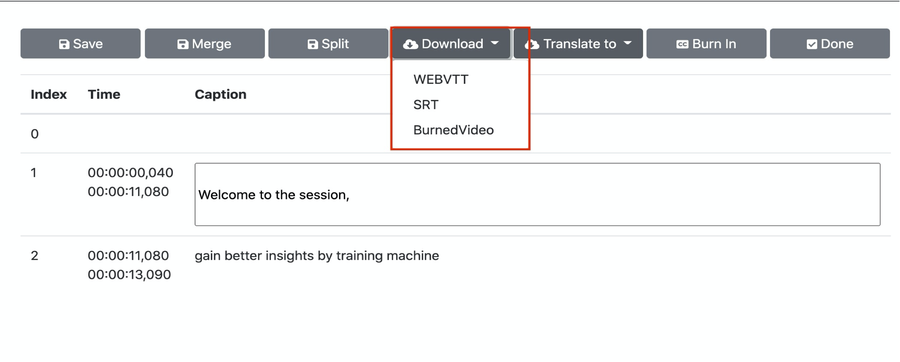

在部署解决方案之前，建议您先查看本指南中有关架构图和区域支持等信息，然后按照下面的说明配置解决方案并将其部署到您的账户中。

**部署时间**：约10分钟

## 部署概述

您可以在亚马逊云科技上部署并使用解决方案，过程如下：

- 步骤1：启动堆栈。
    - 从中国区域启动堆栈 
    - 从全球区域启动堆栈
- 步骤2：访问网页控制台。
- 步骤3：上传视频并进行视频字幕操作。

## 步骤1: 启动堆栈

此自动化Amazon CloudFormation模板在亚马逊云科技中部署解决方案。

### 从中国区域启动堆栈

**前提条件**

1. 确认已有ICP备案的域名。因为中国区域的CloudFront地址不能直接访问，这个域名会作为CNAME指向该解决方案部署后创建的CloudFront地址，您可以通过这个域名来访问。
2. 创建域名托管区域。如果还没有创建托管区域，请参考[使用托管区域][hostedzone]。

**部署Amazon CloudFormation模板**

1. 登录到Amazon Web Services管理控制台，选择链接启动Amazon CloudFormation模板。
    - [由光环新网运营的亚马逊云科技中国（北京）区域链接][template-china1]
    - [由西云数据运营的亚马逊云科技中国（宁夏）区域链接][template-china2]

2. 默认情况下，该模板将在您登录控制台后默认的区域启动。若需在指定的Amazon Web Service区域中启动该解决方案，请在控制台导航栏中的区域下拉列表中选择。

3. 在**创建堆栈**页面上，确认Amazon S3 URL文本框中显示正确的模板URL，然后选择**下一步**。

4. 在**指定堆栈详细信息**页面，为您的解决方案堆栈分配一个账户内唯一且符合命名要求的名称。

5. 在**参数**部分，查看解决方案模板的参数并根据需要进行修改，然后选择**下一步**。

    |  参数名称   |  默认值 |  描述 |
    |  ----------  | ---------| -----------  |
    | **APIKey**  | 无  | 输入部署完成后登录系统所需的认证信息。|
    | **TranscribeLanguage**    | zh-CN    | 从列表中选择默认的字幕处理语言。目前支持en-AU、en-US、en-GB、es-US、en-IN、de-DE、hi-IN、pt-BR、pt-PT、fr-CA、fr-FR、it-IT、ta-IN、te-IN、zh-CN、ja-JP、ko-KR、ar-AE、ar-SA。想要了解Amazon Translate支持的语言和语言代码，可参阅[什么是Amazon Translate][what-is-translate]。 |

6. 在**配置堆栈选项**页面，选择**下一步**。

7. 在**审核**页面，查看并确认设置。确保选中确认模板将创建Amazon Identity and Access Management（IAM）资源的复选框。选择**下一步**。

8. 选择**创建堆栈**以部署堆栈。

您可以在Amazon CloudFormation控制台的**状态**列中查看堆栈的状态。正常情况下，大约10分钟内可以看到状态为**CREATE_COMPLETE**。

**在Route53创建记录用于解析域名**

1. 登录Route53的管理界面，选择**创建记录**。

2. 在**记录名称**文本框内输入所需要的二级域名，后缀默认为ICP备案的一级域名，例如，video-transctiber.ch.test.com。

3. 选择**记录类型**为CNAME。

4. 在**值**文本框内输入CloudFront的地址，注意其中不包括https://。例如，xxxxxx.cloudfront.cn。您可在Amazon CloudFormation的**输出**标签页中查看创建的CloudFront的地址。

5. 选择**创建记录**完成操作。

**在CloudFront中配置CNAME**

1. 登录CloudFront的管理页面，选择该方案的**分配**。

2. 选择**编辑**进入**编辑设置**.

3. 在**备用域名(CNAME)**项选择**添加项目**，输入域名。例如：video-transctiber.ch.test.com。

4. 选择**保存更改**。等待CloudFront自动完成部署，配置即可生效。

### 从全球区域启动堆栈

**部署Amazon CloudFormation模板**

1. 登录到Amazon Web Services管理控制台，选择[全球区域链接][template-global]启动Amazon CloudFormation模板。

2. 默认情况下，该模板将在您登录控制台后默认的区域启动。若需在指定的Amazon Web Service区域中启动该解决方案，请在控制台导航栏中的区域下拉列表中选择。

3. 在**创建堆栈**页面上，确认Amazon S3 URL文本框中显示正确的模板URL，然后选择**下一步**。

4. 在**指定堆栈详细信息**页面，为您的解决方案堆栈分配一个账户内唯一且符合命名要求的名称。

5. 在**参数**部分，查看解决方案模板的参数并根据需要进行修改，然后选择**下一步**。

    |  参数名称   |  默认值 |  描述 |
    |  ----------  | ---------| -----------  |
    | **APIKey**  | 无  | 输入部署完成后登录系统所需的认证信息。|
    | **TranscribeLanguage**    | zh-CN    | 从列表中选择默认的字幕处理语言。目前支持en-AU、en-US、en-GB、es-US、en-IN、de-DE、hi-IN、pt-BR、pt-PT、fr-CA、fr-FR、it-IT、ta-IN、te-IN、zh-CN、ja-JP、ko-KR、ar-AE、ar-SA。想要了解Amazon Translate支持的语言和语言代码，可参考[什么是Amazon Translate][what-is-translate]。 |

6. 在**配置堆栈选项**页面，选择**下一步**。

7. 在**审核**页面，查看并确认设置。确保选中确认模板将创建Amazon Identity and Access Management（IAM）资源的复选框。选择**下一步**。

8. 选择**创建堆栈**以部署堆栈。

您可以在Amazon CloudFormation控制台的状态列中查看堆栈的状态。正常情况下，大约10分钟可以看到状态为**CREATE_COMPLETE**。

## 步骤2: 访问网页控制台

在堆栈创建成功后，您可在Amazon CloudFormation的**输出**标签页中查看访问网页控制台需要的认证信息（**APIKey**）和创建的CloudFront地址（**ConsoleUrl**）。

根据您启动堆栈的区域情况，您可以选择从中国区域或全球区域访问网页控制台。

### 从中国区域访问

1. 在浏览器的地址栏输入https://<域名>。例如，域名为 video-transcriber.ch.test.com。

1. 选择**Enter API Key**，在弹出的输入框中输入认证信息。

### 从全球区域访问

1. 在浏览器的地址栏输入CloudFront地址。

1. 选择**Enter API Key**，在弹出的输入框中输入认证信息。

## 步骤3: 上传视频并进行视频字幕操作

在网页控制台选择页面上方的**Videos**，页面显示四个页签，分别对应视频的不同状态：

- 处理中的视频
- 处理完毕，可以编辑的视频
- 标记为编辑完成的视频
- 处理过程中出错的视频

### 上传视频

您可以上传没有字幕的视频进行处理。

1. 在**Videos**页面，选择**Upload videos…**。

2. 选中视频，然后选择**打开**。

3. 从列表中选中想要生成的字幕语言，如果需要使用自定义的词汇表，请从**select a vocabulary**中选择词汇表（请参考 [自定义词汇表][transcribe-custom-vocabulary] 了解自定义词汇表详情），然后选择**Start**。系统将开始上传视频并自动处理生成字幕。

首先视频显示在**Processing**页签，当生成字幕完成后，将显示在**Ready to edit**页签。

### 对照视频校对和编辑字幕

您可以对视频字幕进行校对和编辑。

1. 在**Videos**页面，选择**Ready to edit**页签。

2. 从**Video Language**列选择语言，进入字幕编辑页面。功能包括：

    - 逐段播放视频内容从而校对字幕内容。
    - 修改字幕内容。
    - 将字幕段落进行合并和拆分。

### 翻译字幕

您可以对视频字幕进行翻译以及后续的校对和编辑操作。

!!! Note "说明"
    
    该功能目前仅全球区域部署版本支持。

1. 在字幕编辑页面，选择**Translate to**。

2. 在下拉列表中选择目标语言后，系统会在后台将字幕翻译成目标语言。翻译结束后，还可以对翻译后的字幕进行校对和编辑。

### 烧入字幕
您可将已经生成好的字幕烧入到视频中，制作出硬字幕视频。

1. 在**Videos**页面，选择**Ready to edit**页签。

2. 从**Video Language**列选择语言，进入字幕编辑页面。

3. 选择**Burn in**。

### 下载字幕或硬字幕视频

字幕或硬字幕视频生成后，您可通过网页控制台直接下载：

- 如果视频处于编辑状态，选择视频和对应语言进入视频编辑页面进行下载。

- 如果视频处于完成状态，可直接在**Videos**页面的**Completed**页签中下载视频对应语言的字幕或视频。

[hostedzone]:https://docs.aws.amazon.com/zh_cn/Route53/latest/DeveloperGuide/hosted-zones-working-with.html

[template-china1]:https://cn-north-1.console.amazonaws.cn/cloudformation/home?region=cn-north-1#/stacks/create/template?stackName=VideoTranscriber&templateURL=https://aws-gcr-solutions.s3.cn-north-1.amazonaws.com.cn/Video-Transcriber/latest/video-transcriber-deplo-cn.template

[template-china2]:https://cn-northwest-1.console.amazonaws.cn/cloudformation/home?region=cn-northwest-1#/stacks/create/template?stackName=VideoTranscriber&templateURL=https://aws-gcr-solutions.s3.cn-north-1.amazonaws.com.cn/Video-Transcriber/latest/video-transcriber-deplo-cn.template

[what-is-translate]:https://docs.aws.amazon.com/zh_cn/translate/latest/dg/what-is.html

[transcribe-custom-vocabulary]:https://docs.aws.amazon.com/zh_cn/transcribe/latest/dg/custom-vocabulary.html

[template-global]: https://console.aws.amazon.com/cloudformation/home?region=us-east-1#/stacks/create/template?stackName=VideoTranscriber&templateURL=https://aws-gcr-solutions.s3.amazonaws.com/Video-Transcriber/latest/video-transcriber-deploy.template

