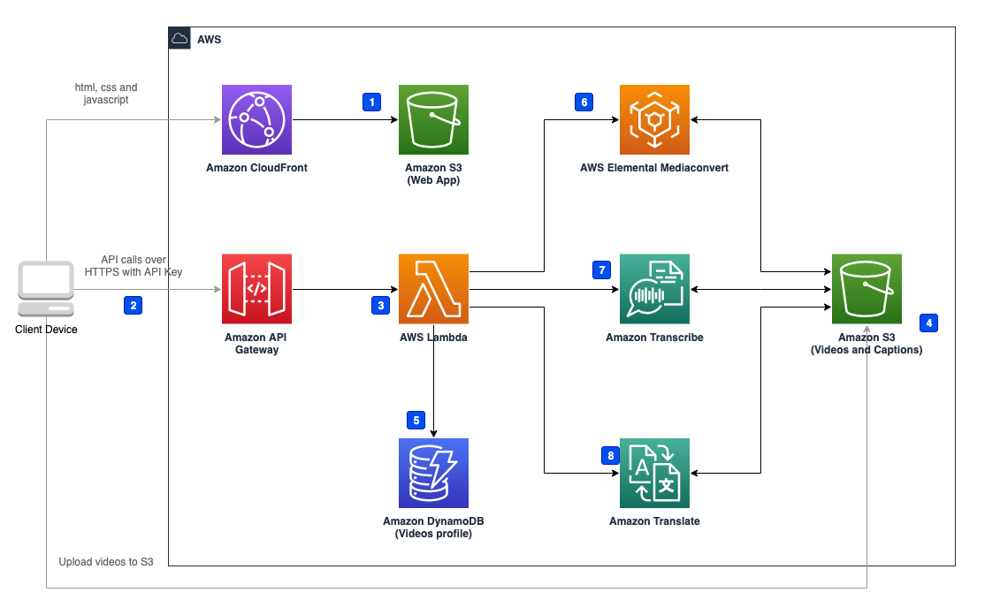

使用默认参数部署视频字幕字幕解决方案后，在亚马逊云科技中构建的环境如下图所示。

      
图：视频字幕解决方案架构

本解决方案在您的亚马逊云科技账户中部署Amazon CloudFormation模板并完成以下设置。

1. [Amazon S3][s3] (Web App)保存前端静态文件。
2. 客户端通过[Amazon API Gateway][api-gateway]发送请求。
3. [AWS Lambda][lambda] Function接收Amazon API Gateway的请求，处理本方案的业务逻辑。
4. 客户端从AWS Lambda获得预签名URL之后上传需要处理的视频。
5. AWS Lambda Function从[Amazon DynamoDB][dynamodb]中获取/更新视频的相关信息。
6. AWS Lambda Function调用[AWS Elemental MediaConvert][mediaconvert]进行视频处理，包括从视频中提取音频和将字幕烧入视频中，并将结果保存到Amazon S3 (Videos)。
7. AWS Lambda Function调用[Amazon Transcribe][transcribe]从音频中提取字幕，并将结果保存到Amazon S3 (Captions)。
8. AWS Lambda Function调用[Amazon Translate][translate]将字幕翻译成其它语言，并将结果保存到Amazon S3 (Captions)。

本方案在Amazon S3存储桶中部署了一个Web应用，Amazon S3存储桶只能通过CloudFront访问。

Amazon API Gateway通过API Key进行认证，客户端必须输入正确的API Key才能访问Amazon API Gateway。

[s3]: https://aws.amazon.com/cn/s3/
[api-gateway]: https://aws.amazon.com/cn/api-gateway/
[lambda]: https://aws.amazon.com/cn/lambda/
[dynamodb]: https://aws.amazon.com/cn/dynamodb/
[mediaconvert]: https://aws.amazon.com/cn/mediaconvert/
[transcribe]: https://aws.amazon.com/cn/transcribe/
[translate]: https://aws.amazon.com/cn/translate/