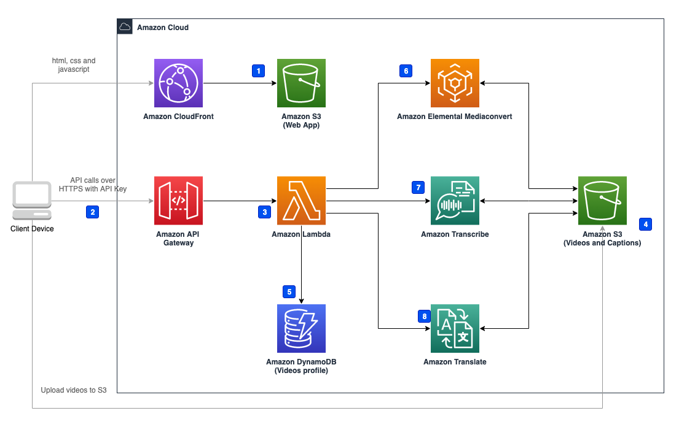

下图展示的是使用默认参数部署本解决方案在亚马逊云科技中构建的环境。

      
图：方案架构

本解决方案在您的亚马逊云科技账户中部署Amazon CloudFormation模板并完成以下设置。

1. Amazon Simple Storage Service（Amazon S3) bucket保存前端静态文件
2. 客户端通过Amazon API Gateway 发送请求
3. Amazon Lambda Function 接收API Gateway的请求，处理本方案的业务逻辑。
4. 客户端获得signURL后上传需要处理的视频
5. Amazon Lambda Function从Amazon DynamoDB中获取/更新视频的相关信息
6. Amazon Lambda Function调用Amazon Elemental Mediaconvert进行视频处理，包括从视频中提取音频和将字幕烧入视频中，并将结果保存在Amazon S3中
7. Amazon Lambda Function调用Amazon Transcribe从音频中提取字幕，并将结果保存在Amazon S3中
8. Amazon Lambda Function调用Amazon Translate将字幕翻译成其它语言，并将结果保存在Amazon S3中

本方案在Amazon S3桶中部署了一个 web 应用，S3桶只能通过CloudFront访问。API Gateway通过API Key进行认证，客户端必须输入正确的API Key才能访问API Gateway。