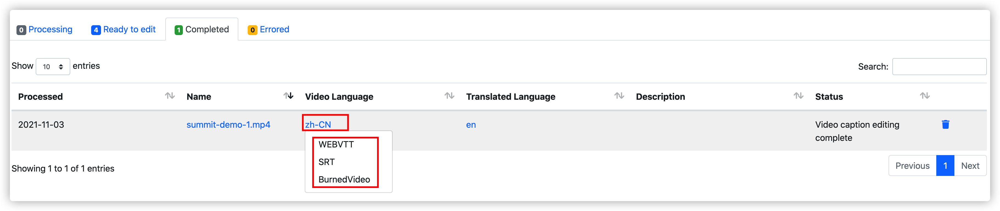

## 背景

本部署指南详细描述了如何在云上使用 Amazon CloudFormation 模板部署 **视频字幕** 解决方案

## 解决方案描述
该方案基于Amazon Lambda无服务架构，集成Amazon Transcribe , Amazon Translate，Amazon Elemental MediaConvert，Amazon S3，Amazon DynamoDB等服务，帮助客户自动生成视频字幕，翻译字幕，同时客户也能通过方案提供的web console对照视频校对和编辑字幕，以及生成硬字幕视频。

本方案使用 Lambda 、 Amazon API Gateway 等无服务架构方案，用户无需担心在云中或本地管理和运行服务器或运行时。只需按实际使用量支付费用。

## 使用场景
本解决方案适用教育，媒体等需要处理视频的行业。对于需要对视频添加字幕和翻译字幕，在生成字幕过程中，想要校对，编辑字幕等场景，都可以大幅减少人工成本，提高效率。

## 系统架构
本解决方案架构为基于 Amazon Lambda 的无服务架构实现， 前端静态文件保存于Amazon S3，由Amazon Cloudfront提供内容分发网络（CDN）服务，Amazon API Gateway 为前端提供Rest接口，后段将接收到的用户请求直接发送给 Lambda 函数。Lambda 函数通过调用Amazon Elemental MediaConvert 提取视频中的音频以及将字幕烧入视频。通过调用Amazon Transcribe从音频中提取字幕。通过调用Amazon Translate翻译字幕。

### 架构图
此解决方案可以在由西云数据运营的 Amazon Web Services（宁夏）区域或由光环新网运营的Amazon Web Services（北京）区域中部署，也可部署在 Amazon Web Services 其他海外区域。

### 组件

Amazon Cloudfront
- 用于静态页面的快速内容分发网络(CDN)服务。

Amazon Simple Storage Service (Amazon S3)
- 保存静态页面assets
- 保存上传的视频，生成的字幕和硬字幕视频
- 保存处理过程中的中间数据。

Amazon API Gateway 
- 提供Rest接口给前端页面
- 认证API的调用

Amazon Lambda 
- 处理后端服务的业务逻辑。

Amazon DynamoDB 
- 保存视频的相关信息，处理过程中的状态信息以及字幕映射表

Amazon Elemental MediaConvert 
- 从视频中提取音频
- 将字幕烧入视频

Amazon Transcribe
- 将音频内容转换成文字

Amazon Translate
- 提供字幕语言翻译功能。

## 快速部署
以下部署说明适用于在由西云数据运营的Amazon Web Services（宁夏）区域或由光环新网运营的Amazon Web Services（北京）区域中部署的解决方案，也适用于 Amazon Web Services 其他海外区域。您可以使用以下链接快速启动一个Amazon CloudFormation堆栈来部署和管理整个方案。

### 部署前提（中国区域）
1.	对于中国区，需要有经过 ICP 备案的域名，因为中国区的CloudFront地址不能直接访问，这个域名会作为CNAME指向该解决方案部署完生成的CloudFront的地址，Web 控制台通过在这个域名来访问。
2.	创建域名托管区域：如果没有创建托管区域，请参考https://aws.amazon.com/cn/route53/

### 启动 CloudFormation 堆栈
打开 Amazon Web Services 管理控制台（如果还没登录则会先跳转到登录页面，登录后进入模板启动页面）。您可以使用控制台右上方的区域选择链接，选择要部署的区域。然后，单击下面的链接以启动 Amazon CloudFormation 模板。

| 快速启动链接                                                                                                                                                                                                                                               | 描述                                        |
| -------------------------------------------------------------------------------------------------------------------------------------------------------------------------------------------------------------------------------------------------------- | ------------------------------------------- |
| [北京区域](https://cn-north-1.console.amazonaws.cn/cloudformation/home?region=cn-north-1#/stacks/create/template?stackName=VideoTranscriber&templateURL=https://aws-gcr-solutions.s3.cn-north-1.amazonaws.com.cn/Video-Transcriber/latest/video-transcriber-deplo-cn.template)            |  在**北京**区域部署 视频字幕解决方案  |
| [宁夏区域](https://cn-northwest-1.console.amazonaws.cn/cloudformation/home?region=cn-northwest-1#/stacks/create/template?stackName=VideoTranscriber&templateURL=https://aws-gcr-solutions.s3.cn-north-1.amazonaws.com.cn/Video-Transcriber/latest/video-transcriber-deplo-cn.template)        |  在**宁夏**区域部署 视频字幕解决方案  |
| [海外区域](https://console.aws.amazon.com/cloudformation/home?region=us-east-1#/stacks/create/template?stackName=VideoTranscriber&templateURL=https://aws-gcr-solutions.s3.amazonaws.com/Video-Transcriber/latest/video-transcriber-deploy.template)                                  |  在**海外**区域部署 视频字幕解决方案  |

在默认情况下，该模板将在您登录控制台后后默认的区域启动。若需在指定的 Amazon Web Service 区域中启动该解决方案，请在控制台导航栏中的区域下拉列表中选择。

在创建堆栈页面上，确认Amazon S3 URL文本框中显示正确的模板URL，然后单击Next按钮。

在Stack name文本框中填写/确认堆栈名称，并确认参数是否填写正确，然后单击Next按钮。

**参数说明**

|  参数名称   |  默认值 |  描述 |
|  ----------  | ---------| -----------  |
| **APIKey**  |   | 安装完成后登陆系统需要输入的认证信息|
| **TranscribeLanguage**    | zh-CN    | 选择默认的处理语言 |

在审核页面上，查看并确认设置。确保选中确认模板将创建Amazon Identity and Access Management（IAM）资源的复选框。

单击 Create stack 按钮以部署堆栈。
您可以在Amazon CloudFormation控制台的状态列中查看堆栈的状态。您应该在大约10分钟内看到状态成为**CREATE_COMPLETE**。

在堆栈创建成功后，可在Amazon CloudFormation的Outputs标签页中看到 **APIKey** 的值和创建的CloudFront的URL。

## 在 Route53 创建记录集用于解析域名（针对中国区域）
进入 Route53 的管理界面，点击 【创建记录集】按钮。

填入如下信息：
- 名称：填入Video Transcriber所需要的二级域名，后缀默认为ICP备案的一级域名，例如 video-transctiber.ch.test.com
- 别名：选择 “是” 单选框按钮
别名目标：选择 CloudFormation输出的CloudFront的地址，注意不要加http://, 比如xxxxxx.cloudfront.cn

## 在 CloudFront中配置CNAME（针对中国区域）
在CNAME中填入Video Transcriber的域名，按上例，如：video-transctiber.ch.test.com

保存之后等待Cloudfront部署结束，配置即可生效

## 开始使用

### 访问首页

在浏览器的地址栏输入 https://你的域名 , 如上面定义的video-transcriber.ch.test.com。
如果显示下面的界面，说明该方案部署成功，可以正常访问：

### 输入认证信息（API Key)

在首页点击“Enter API Key”按钮，在弹出的输入框中输入部署时输入的API Key

### 视频管理
点击页面上方的“Videos”，页面列出所有上传的视频，有四个tab，分别显示：
- 处理中的视频
- 处理完毕，可以编辑的视频
- 标记为编辑完成的视频
- 处理过程中出错的视频

### 上传视频
在“Videos”页面，点击“Upload videos…”,选择上传视频和处理语言，然后上传视频，系统自动处理产生字幕.

### 对照视频校对和编辑字幕
在“Videos”页面，点击“Ready to edit”tab，选择需要编辑的视频和语言，进入到字幕编辑页面进行校对和编辑。
功能包括
- 逐段播放视频内容。
- 修改内容。
- 段落合并和拆分。

### 翻译字幕
在编辑字幕的页面，选择“Translate to", 在下拉列表中选择目标语言后，系统会在后台将字幕翻译成目标语言。翻译结束后，同样可以对翻译后的语言进行校对和编辑。

### 烧入字幕
用户可将已经生成好的字幕烧入到视频中制作出硬字幕视频, 同样在“Videos”页面，点击“Ready to edit”tab，选择需要编辑的视频和语言，进入到字幕编辑页面，选择"Burn in"

### 下载字幕或视频
字幕或硬字幕视频生成后，用户可通过Web Console直接下载
- 视频处于编辑状态的话，选择视频和对应语言进入编辑页面进行下载

- 视频处于完成状态，可直接在“Videos”页面的"Completed" tab中，下载对应视频的对应语言的字幕或视频。

## 卸载部署

您可以通过Amazon CloudFormation卸载对应的堆栈，整个删除过程大约需要10分钟。