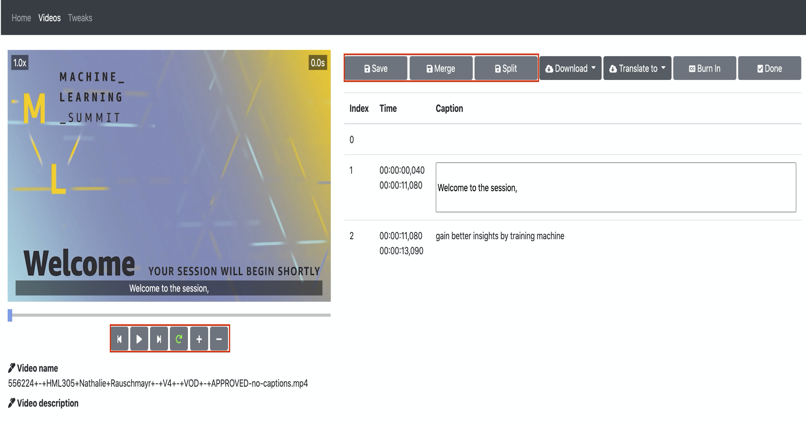
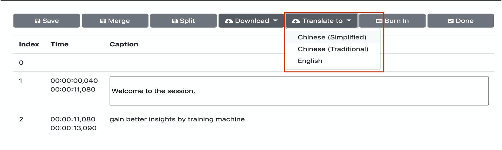

在部署解决方案之前，建议您先查看本指南中有关架构图和区域支持等信息。然后按照下面的说明配置解决方案并将其部署到您的帐户中。

**部署时间**：约10分钟

## 部署概述
在亚马逊云科技上部署本解决方案主要包括以下过程：

- 步骤一：启动堆栈。
- 步骤二：访问网页控制台。
- 步骤三：管理视频。

## 启动堆栈(中国区)

此自动化Amazon CloudFormation模板在亚马逊云科技中部署解决方案。

**前提条件**
1.	对于中国区，需要有经过ICP备案的域名，因为中国区的CloudFront地址不能直接访问，这个域名会作为CNAME指向该解决方案部署完生成的CloudFront的地址，Web控制台通过在这个域名来访问。
2.	创建域名托管区域：如果没有创建托管区域，请参考https://aws.amazon.com/cn/route53/

### 部署Amazon CloudFormation模板

1. 登录到Amazon Web Service管理控制台，选择[链接][template-global]启动Amazon CloudFormation模板。

1. 默认情况下，该模板将在您登录控制台后默认的区域启动。若需在指定的Amazon Web Service区域中启动该解决方案，请在控制台导航栏中的区域下拉列表中选择。

1. 在**创建堆栈**页面上，确认Amazon S3 URL文本框中显示正确的模板URL，然后选择**下一步**。

1. 在**指定堆栈详细信息**页面，为您的解决方案堆栈分配一个账户内唯一且符合命名要求的名称。

1. 在**参数**部分，查看解决方案模板的参数并根据需要进行修改，然后选择**下一步**。

|  参数名称   |  默认值 |  描述 |
|  ----------  | ---------| -----------  |
| **APIKey**  |   | 安装完成后登录系统需要输入的认证信息|
| **TranscribeLanguage**    | zh-CN    | 默认的字幕处理语言 |

1. 在**配置堆栈选项**页面，选择**下一步**。

1. 在**审核**页面，查看并确认设置。确保选中确认模板将创建Amazon Identity and Access Management（IAM）资源的复选框。

1. 选择**创建堆栈**以部署堆栈。

您可以在Amazon CloudFormation控制台的状态列中查看堆栈的状态。您应该在大约10分钟内看到状态成为**CREATE_COMPLETE**。

## 在 Route53 创建记录集用于解析域名（适用于中国区域）
进入 Route53 的管理界面，点击 【创建记录集】按钮。

填入如下信息：
- 名称：填入Video Transcriber所需要的二级域名，后缀默认为ICP备案的一级域名，例如 video-transctiber.ch.test.com
- 别名：选择 “是” 单选框按钮
别名目标：选择 CloudFormation输出的CloudFront的地址，注意不要加http://, 比如xxxxxx.cloudfront.cn

## 在CloudFront中配置CNAME（适用于中国区域）
在CNAME中填入Video Transcriber的域名，按上例，如：video-transctiber.ch.test.com

保存之后等待Cloudfront部署结束，配置即可生效

## 访问网页控制台

在堆栈创建成功后，可在Amazon CloudFormation的Outputs标签页中看到 **APIKey** 的值和创建的CloudFront的URL。

1. 在浏览器的地址栏输入 https://你的域名 , 如上面定义的video-transcriber.ch.test.com。

1. 选择**Enter API Key**，在弹出的输入框中输入部署时输入的认证信息(API Key)。

## 管理视频
您可以在网页控制台点击页面上方的“Videos”，页面列出所有上传的视频，有四个tab，分别显示：
- 处理中的视频
- 处理完毕，可以编辑的视频
- 标记为编辑完成的视频
- 处理过程中出错的视频

### 上传视频
在“Videos”页面，点击“Upload videos…”,选择上传视频和处理语言，然后上传视频，系统自动处理产生字幕.

### 对照视频校对和编辑字幕
在“Videos”页面，点击“Ready to edit”tab，选择需要编辑的视频和语言，进入到字幕编辑页面进行校对和编辑。
功能包括
- 逐段播放视频内容。
- 修改内容。
- 段落合并和拆分。

### 翻译字幕
在编辑字幕的页面，选择“Translate to", 在下拉列表中选择目标语言后，系统会在后台将字幕翻译成目标语言。翻译结束后，同样可以对翻译后的语言进行校对和编辑。

### 烧入字幕
用户可将已经生成好的字幕烧入到视频中制作出硬字幕视频, 同样在“Videos”页面，点击“Ready to edit”tab，选择需要编辑的视频和语言，进入到字幕编辑页面，选择"Burn in"

### 下载字幕或视频
字幕或硬字幕视频生成后，用户可通过Web Console直接下载
- 视频处于编辑状态的话，选择视频和对应语言进入编辑页面进行下载

- 视频处于完成状态，可直接在“Videos”页面的"Completed" tab中，下载对应视频的对应语言的字幕或视频。

[template-global]: https://console.aws.amazon.com/cloudformation/home?region=us-east-1#/stacks/create/template?stackName=VideoTranscriber&templateURL=https://aws-gcr-solutions.s3.amazonaws.com/Video-Transcriber/latest/video-transcriber-deploy.template

